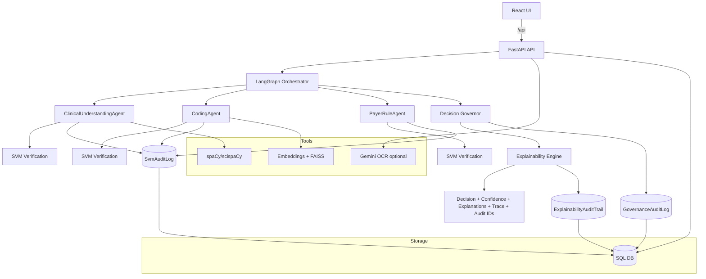
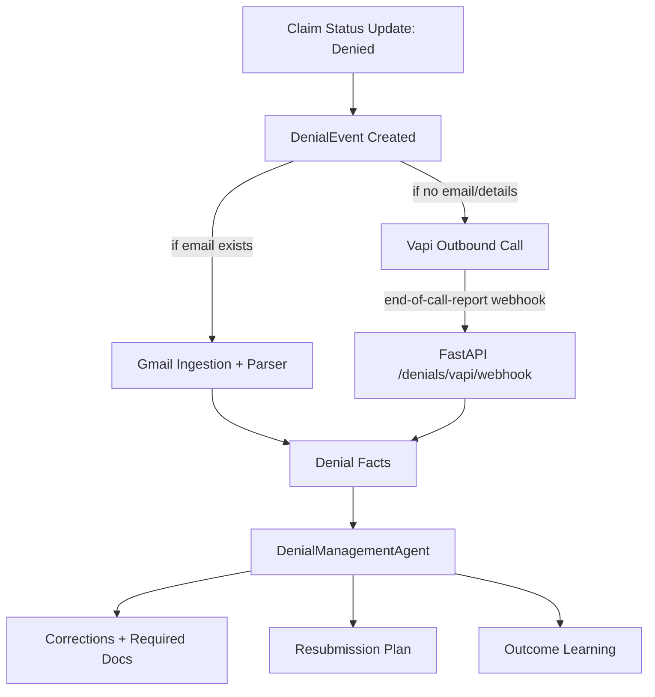
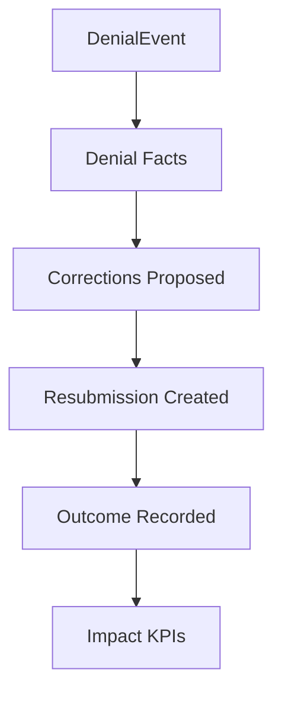

# MedLedger AI — Architecture, Agent Roles, and Impact Model

This document provides a compact 1–2 page view of agent roles, how they communicate, tool integrations, and error-handling logic, plus the impact model used by the denial recovery dashboard.

## System Diagram (Agents + Verification + Governance + Explainability)

## Agent Roles (Responsibilities)

- **ClinicalUnderstandingAgent**
  - Extracts structured clinical entities (diagnoses, procedures, medications) from unstructured notes.
  - Produces evidence-backed entities used downstream for coding and rules.

- **CodingAgent**
  - Suggests ICD-10 codes and supporting evidence (semantic similarity / matches).
  - Uses retrieval (embeddings/FAISS) to ground code suggestions.

- **PayerRuleAgent**
  - Evaluates payer/TPA rules against the claim context.
  - Emits violations, missing documentation requirements, and policy flags.

- **SVM Verification (per-stage)**
  - Runs after clinical, coding, and rules stages.
  - Produces stage scores (alignment, consistency, reasonability) and structured issues.

- **Decision Governor (Governance Layer)**
  - Aggregates confidence and applies thresholds/policy actions.
  - Outputs a final decision: `APPROVE | WARN | BLOCK | ESCALATE`, plus a final confidence.

- **Explainability Engine**
  - Renders human-readable explanations from config-driven templates and selection rules.
  - Outputs both readable explanations and structured details (template_id, rule_id, params) for audit/replay.

## How They Communicate (State + Trace)

Communication between agents is structured and traceable:

- **Shared workflow state**
  - The orchestrator maintains a structured state object (entities, codes, rule results, verification scores, governance outputs).
  - Each agent reads the fields it needs and writes new fields for downstream agents.

- **Traceability**
  - Each run is traceable via a `trace_id` and ordered steps, allowing replay and audit.
  - Audit records link to the same run metadata so the pipeline is reconstructible.

- **Structured I/O**
  - Agents exchange JSON-like structures rather than free-form text.
  - Explanations are rendered at the end from templates and rules, not hardcoded strings.

## Tool Integrations (What Gets Called)

- **spaCy/scispaCy**: clinical entity extraction from noisy clinical text.
- **Embeddings + FAISS**: semantic retrieval for coding assistance and matching.
- **Gemini (optional)**: fallback OCR/extraction for scanned/handwritten inputs (when enabled).

## Error Handling Logic (What Happens When Things Go Wrong)

Error-handling is designed to prevent crashes and preserve auditability:

- **Stage errors become structured issues**
  - Parsing failures, missing signals, or low-quality extraction are surfaced as structured issues.
  - Downstream agents can continue (where safe) using partial outputs.

- **Verification downgrades confidence**
  - SVM verification can reduce confidence or mark stage outputs as unreliable.
  - Governance can escalate the decision based on verification issues.

- **Governance gating**
  - Guardrails can override earlier “success” and force `WARN/BLOCK/ESCALATE`.

- **Explainability resilience**
  - Explanation generation is template/rule-driven and can emit partial explanations if a single item fails to render.
  - The response always remains structured and audit-linked.

## Denial Recovery Diagram (Email + Vapi Call + Corrections)

Notes:
- If you run locally, Vapi webhooks require a public URL (ngrok). On localhost, use a tunnel or the manual “sync result” approach to pull call results.

## Impact Model (Business KPIs)

The impact model converts denials, actions, and outcomes into metrics displayed on the Business Impact Dashboard (`/impact`).

### Impact Flow

### KPI Definitions

- **Revenue recovered (₹)**: sum of recovered/paid outcomes after denial-driven corrections and resubmission.
- **Denial reduction (%)**: reduction in denied outcomes vs total submissions over the same time window (demo uses recorded outcomes as a proxy).
- **Automation (%)**: percentage of denial cases where the system produced an actionable correction/resubmission plan without manual override.
- **Time-to-resolution**: time from denial event creation to successful recorded outcome.

### Evidence and Auditability

Each KPI is backed by per-claim evidence:
- denial reason/root cause (from email or call)
- correction actions and documents required
- resubmission record
- linked audit logs for explainability, governance, and verification
